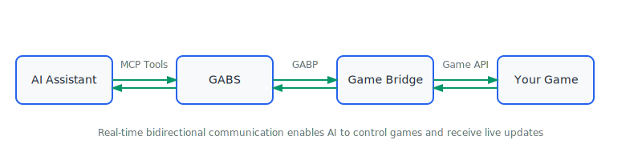

# GABS - Game Agent Bridge Server

**Let AI control your games naturally!**

GABS connects AI assistants to your games through a simple, secure bridge. Configure your games once, then ask your AI to start servers, check status, or manage multiple games—all through natural conversation.

## Why GABS?

**For Everyone:**
- **Simple Setup**: Configure games once with easy commands
- **Natural Control**: Ask AI to manage games in plain English
- **Works Everywhere**: Windows, macOS, Linux—one tool for all your games
- **Secure**: Everything runs locally by default
- **Real Examples**: "Start my Minecraft server", "Check if RimWorld is running", "Stop all games"

**For Modders:**
- **AI-Powered Development**: Let AI help test and debug your mods
- **Universal**: Works with any game that can add GABP support
- **Easy Integration**: GABP/gabp-runtime-compatible handshake with canonical tool schemas

## How It Works

GABS uses a **configuration-first approach**. You set up your games once, then AI controls them through simple tools.



### Key Architecture Concepts

**Communication Flow:**
```
AI Agent ← MCP → GABS ← GABP → Game Mod ← Game API → Game
```

**Important:** In the GABP layer, **your game mod acts as the server** (listening on a port) while **GABS acts as the client** (connecting to your mod). This design ensures:
- GABS manages port allocation for multiple games
- All communication stays local (127.0.0.1)
- Games can start independently and GABS connects when ready

**Key Features:**
- **Configure once**: Add games with `gabs games add`
- **Control with AI**: Natural commands through MCP tools
- **Any game**: Works with modded games that support GABP
- **Any AI**: Works with Claude Desktop, Codex CLI, and other MCP-capable clients
- **Live discovery**: AI gets MCP `tools/list_changed` and `resources/list_changed` notifications as games connect

## Quick Start

### 1. Download GABS

Download the latest release bundle for your system from [GitHub Releases](releases/latest).

Available archives are named like:
- **Windows x64**: `gabs-<version>-windows-amd64.zip`
- **macOS Apple Silicon**: `gabs-<version>-darwin-arm64.zip`
- **macOS Intel**: `gabs-<version>-darwin-amd64.zip`
- **Linux x64**: `gabs-<version>-linux-amd64.zip`
- **Linux ARM64**: `gabs-<version>-linux-arm64.zip`

Each archive contains:
- the `gabs` binary (`gabs.exe` on Windows)
- `README.md`
- the full `docs/` folder
- `example-config.json`
- `LICENSE`

After unzipping:

**Windows**
```powershell
.\gabs.exe version
```

**macOS / Linux**
```bash
chmod +x gabs
./gabs version
```

### 2. Add Your Games

```bash
# Interactive setup (recommended)
gabs games add minecraft
gabs games add rimworld

# See what you've configured
gabs games list

# Validate one game's launch/stop setup
gabs games show rimworld
```

GABS will ask simple questions to set up each game:
- **Game Name**: Friendly display name
- **Launch Mode**: How to start the game (Direct executable, Steam App ID, Epic, or Custom command)
- **Target**: Path to executable or Steam/Epic App ID
- **Stop Process Name**: **Required for Steam/Epic games** - the actual game process name for proper stopping

**Critical for Steam/Epic users:** GABS **requires** the actual game process name (like `RimWorldWin64.exe` for RimWorld, `java` for Minecraft) to properly stop games launched through Steam or Epic. Without this, GABS can start games but cannot stop them reliably.

Use `gabs games show <game-id>` after setup to confirm the launch target and `stopProcessName` that AI will rely on.

### 3. Start the Server

```bash
# For AI assistants
gabs server

# For web tools (optional)
gabs server --http localhost:8080
```

### 4. Connect Your AI

Add GABS to your AI's MCP settings:

**Claude Desktop:**
```json
{
  "mcpServers": {
    "gabs": {
      "command": "/path/to/gabs",
      "args": ["server"]
    }
  }
}
```

**Codex CLI:**
```toml
[mcp_servers.gabs]
command = "/absolute/path/to/gabs"
args = ["server"]
```

**Generic MCP client:**

Point your client at the `gabs` binary with the `server` subcommand:

```json
{
  "command": "/absolute/path/to/gabs",
  "args": ["server"]
}
```

If your client uses OpenAI-style tool calling constraints, enable the `toolNormalization` section in `~/.gabs/config.json`. See [OpenAI Tool Normalization](docs/OPENAI_TOOL_NORMALIZATION.md) for details.

For a full download-to-config walkthrough, including Claude Desktop, Codex CLI, and generic MCP/OpenAI-style clients, see the [AI Client Setup Guide](docs/AI_CLIENT_SETUP.md).

**Then ask your AI:**
- "List my games"
- "Start the Minecraft server"
- "Stop all running games"
- "Check the status of RimWorld"

## AI Tools Available

Once connected, your AI starts with a stable MCP surface and can then discover dynamic game tools as mods connect.

### Core MCP Tools
- **`games.list`** - List configured game IDs
- **`games.show`** - Show configuration and validation details for a specific game
- **`games.start`** - Start a game: `{"gameId": "minecraft"}`
- **`games.stop`** - Stop a game gracefully: `{"gameId": "minecraft"}`
- **`games.kill`** - Force stop a game: `{"gameId": "minecraft"}`
- **`games.status`** - Check one game or all configured games
- **`games.tool_names`** - List compact game-specific tool names, with optional filtering, pagination, and optional brief summaries in structured output
- **`games.tool_detail`** - Show one game-specific tool's description, parameters, defaults, and output schema; `gameId` is optional when the tool name is fully qualified or uniquely discoverable
- **`games.tools`** - List currently available game-specific tools in detailed form for compatibility and human-readable inspection, with optional filtering, pagination, and structured output
- **`games.connect`** - Manually connect or reconnect to a running game's GABP server after the mod finishes loading or after a GABS restart
- **`games.call_tool`** - Call a discovered game tool through the stable core surface: `{"tool": "minecraft.inventory.get", "arguments": {"playerId": "steve"}}` (`gameId` is optional when the tool name is fully qualified or uniquely discoverable)

### Game-Specific Tools from Mods

**The real power comes from GABP-compliant mods that expose their own tools.**

GABP mods typically expose canonical tool names such as `inventory/get`, `world/place_block`, `crafting/build`, or `core/ping`. GABS now consumes the current `gabp-runtime` method surface (`session/hello`, `tools/list`, `tools/call`) and mirrors those into MCP-friendly, game-prefixed tool names such as:
- **`minecraft.inventory.get`** - Mirrored from GABP `inventory/get`
- **`minecraft.world.place_block`** - Mirrored from GABP `world/place_block`
- **`rimworld.crafting.build`** - Mirrored from GABP `crafting/build`
- **`bannerlord.core.ping`** - Mirrored from GABP `core/ping`

**Game ID Prefixing**: To avoid conflicts when multiple games are running, mirrored mod tools are automatically prefixed with the game ID (for example, `minecraft.` or `rimworld.`). This lets AI clearly specify which game to control, and GABS removes those mirrored tools again when the game disconnects.

**Recommended Discovery Flow**: Use the compact discovery tools first, then fetch detail only for the few candidates you care about:
```
AI: "Reconnect to RimWorld and show me its mod tools"
GABS: games.connect {"gameId": "rimworld"}
GABS: games.tool_names {"gameId": "rimworld", "brief": true}
GABS: games.tool_detail {"tool": "rimworld.crafting.build"}
```

`games.tools` remains available for compatibility when you want the richer one-shot listing, but `games.tool_names -> games.tool_detail -> games.call_tool` is the most token-efficient path for AI clients such as Codex and Claude. `games.tool_names` now defaults to 50 names per page and can include one-line summaries in structured output with `brief: true`.

If your MCP client supports dynamic tool refresh, it can call mirrored tools directly after the `tools/list_changed` notification. If it keeps a fixed tool surface, use `games.call_tool` with the mirrored name returned by `games.tool_names` or `games.tools`:

```json
{
  "tool": "minecraft.inventory.get",
  "arguments": {
    "playerId": "steve"
  }
}
```

Connected games also expose a state resource at `gab://<gameId>/state`.

**Pro tip**: You can use game names (`"minecraft"`) or launch IDs (`"294100"` for Steam) interchangeably in the `games.*` tools. If OpenAI tool normalization is enabled, dotted MCP tool names may be normalized to underscores; the examples above use the canonical MCP names.

## Documentation

- **[AI Client Setup Guide](docs/AI_CLIENT_SETUP.md)** - Install a release bundle and connect Claude Desktop, Codex CLI, or generic MCP clients
- **[Configuration Guide](docs/CONFIGURATION.md)** - Detailed setup for different game types and tool normalization
- **[AI Integration Guide](docs/INTEGRATION.md)** - Connect GABS to different AI tools and deployment scenarios
- **[Mod Development Guide](docs/MOD_DEVELOPMENT.md)** - Add GABP support to your game mods
- **[Advanced Usage Guide](docs/ADVANCED_USAGE.md)** - Multiple instances, HTTP mode, scripting, and more
- **[Deployment Guide](docs/DEPLOYMENT.md)** - Production deployments and cloud setups
- **[OpenAI Tool Normalization](docs/OPENAI_TOOL_NORMALIZATION.md)** - Configure tool name compatibility for OpenAI API
- **[Dynamic Tools Guide](docs/DYNAMIC_TOOLS_GUIDE.md)** - How AI agents handle expanding tool sets
- **[AI Dynamic Tools FAQ](docs/AI_DYNAMIC_TOOLS_FAQ.md)** - Common questions about dynamic tool discovery

## For Mod Developers

Want your game to work with GABS? Add GABP support to your mod:

1. **Read GABP configuration** from environment variables when your game starts:
   - `GABS_GAME_ID` - Your game's identifier
   - `GABP_SERVER_PORT` - Port your mod should listen on
   - `GABP_TOKEN` - Authentication token for GABS connections
   - `GABS_BRIDGE_PATH` - Optional `bridge.json` fallback/debug path
2. **Start a local GABP server** to listen for GABS connections (your mod = server, GABS = client)
3. **Implement the current GABP runtime methods** (`session/hello`, `tools/list`, `tools/call`) or use the official `gabp-runtime` library so your schemas match what GABS expects
4. **Expose game features** as tools, resources, and events using canonical GABP tool names such as `inventory/get` or `core/ping`

See the [Mod Development Guide](docs/MOD_DEVELOPMENT.md) for complete examples in C#, Java, and Python.

## Build from Source

Requirements: Go 1.22+

```bash
# Simple build
go build ./cmd/gabs

# Build with version information (recommended)
make build

# Build with custom version
go build -ldflags "-X github.com/pardeike/gabs/internal/version.Version=v1.0.0" ./cmd/gabs
```

## Contributing & Support

- **Issues & Ideas**: [GitHub Issues](issues)
- **GABP Protocol**: [GABP Repository](https://github.com/pardeike/GABP)
- **Example Configuration**: See `example-config.json` for sample configurations

## License

MIT License - see [LICENSE](LICENSE) for details.

---

*GABS makes AI-game interaction simple. Configure once, control naturally.*
