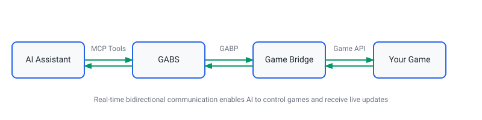

# GABS - Game Agent Bridge Server

Compatible with **GABP v1.1** on wire major **`gabp/1`**.

GABS is a configuration-first MCP server that manages local game processes and
mirrors each game's GABP bridge tools into a stable MCP surface. You declare
your games once in a config file; GABS starts and supervises those processes,
and when a game's GABP bridge connects, GABS mirrors that bridge's tools into
MCP. An AI agent then **discovers and controls a running game entirely through
GABS**.

If you are installing GABS from a release archive, start with **Quick Start**
below. For the full copy-paste setup guide, read the
[AI Client Setup Guide](docs/AI_CLIENT_SETUP.md).

## How GABS works

Each launch resolves along one axis:

    stable game identity  →  optional named profile  →  optional declared, typed launch inputs

- **Games** are declared in a config file. GABS re-reads it on the next call —
  **edits to game entries apply automatically**, with no GABS or MCP-client
  restart. After an edit, `games_show <id>` shows the new profiles, inputs,
  warnings, or the exact error. Top-level settings (`apiKey`,
  `toolNormalization`, `portRanges`, `timeouts`, `stripOutputSchema`) are read
  at startup only and still require a GABS restart.
- **Profiles** select a repeatable launch context (args, env, working directory,
  lifecycle overrides) without changing the game's identity or transport. A bare
  start uses the `defaultProfile`.
- **Launch inputs** add bounded, declared per-launch variation: the config
  author declares named, typed inputs (`boolean`/`string`/`integer`), and
  callers may supply only those. GABS never exposes raw argument/environment
  passthrough on MCP.
- **Lifecycle hooks** (`status`, `stop`, `kill`) let you integrate wrapped or
  containerized process management — GABS runs your commands to observe and
  control the workload.

Two frontends share one implementation:

- **MCP server** (`gabs server`) — for AI agents.
- **CLI** (`gabs games ...`) — for humans and scripts.

The mental model most users need:

- Your AI client starts `gabs server`
- GABS starts or attaches to your game
- If the game-side bridge speaks GABP, GABS mirrors that bridge's tools into MCP



```
AI Agent ← MCP → GABS ← GABP Client → GABP Server (Game Bridge) ← Game API → Game
```

In the GABP layer, your game-side bridge is the server and GABS is the client.

## Quick Start

### 1. Download and verify the binary

Download the latest release bundle for your system from
[GitHub Releases](releases/latest).

Available archives are named like:
- **Windows x64**: `gabs-<version>-windows-amd64.zip`
- **macOS Apple Silicon**: `gabs-<version>-darwin-arm64.zip`
- **macOS Intel**: `gabs-<version>-darwin-amd64.zip`
- **Linux x64**: `gabs-<version>-linux-amd64.zip`
- **Linux ARM64**: `gabs-<version>-linux-arm64.zip`

Each archive contains the `gabs` binary (`gabs.exe` on Windows), `README.md`,
the full `docs/` folder, `example-config.json`, and `LICENSE`.

After unzipping:

**Windows**
```powershell
.\gabs.exe version
```

**macOS / Linux**
```bash
chmod +x gabs
./gabs version
```

### 2. Configure a game

Games live in your config file (`~/.gabs/config.json` by default). You can write
entries by hand or let the interactive setup do it for you:

```bash
gabs games add mygame
```

A minimal entry looks like this — see `example-config.json` for a fully profiled
game with launch inputs and lifecycle hooks:

```json
{
  "version": "1.0",
  "games": {
    "mygame": {
      "id": "mygame",
      "name": "My Game",
      "launchMode": "DirectPath",
      "target": "/opt/mygame/bin/server",
      "stopProcessName": "server",
      "defaultProfile": "dev",
      "profiles": {
        "dev": { "description": "Fast local iteration" }
      }
    }
  }
}
```

`launchMode` may be a direct path, a managed Steam game, an Epic App ID, or a
custom command. For launcher URL modes such as `SteamAppId` and `EpicAppId`,
`games_stop` and `games_kill` need a way to reach the real game process:
declare `stopProcessName`, or a game-level `status` hook plus a `stop` or
`kill` hook — either satisfies the requirement. Because game-entry edits apply
automatically, `gabs games show mygame` always reflects what an edit would
launch.

### 3. Add GABS to your AI client

Paste one of these into your AI client's MCP config.

**Claude Desktop:**
```json
{
  "mcpServers": {
    "gabs": {
      "command": "/path/to/gabs",
      "args": ["server"]
    }
  }
}
```

**Codex CLI:**
```toml
[mcp_servers.gabs]
command = "/absolute/path/to/gabs"
args = ["server"]
```

**Generic MCP client:**
```json
{
  "command": "/absolute/path/to/gabs",
  "args": ["server"]
}
```

If your client uses strict OpenAI-style tool naming, enable `toolNormalization`
in `~/.gabs/config.json`. See
[OpenAI Tool Normalization](docs/OPENAI_TOOL_NORMALIZATION.md). If your client
disconnects after `tools/list` because it rejects a public tool's `outputSchema`
fields, set `stripOutputSchema` to `true` (see the
[Configuration Guide](docs/CONFIGURATION.md)). If a game or bridge starts slowly,
tune the background connection budget with `timeouts.startup`; `games_start`
still returns after a bounded initial wait so MCP clients do not time out while
the game keeps loading.

## From a configured game to a tool call

One end-to-end flow, from a declared game to calling a game-specific tool:

**1. See what's configured** (CLI or the `games_list` MCP tool):
```bash
gabs games list
```

**2. Start the game.** From the CLI:
```bash
gabs games start mygame --profile dev
```
Pass `--input NAME=VALUE` (repeatable) to supply declared launch inputs — see the
fully profiled `world` input in `example-config.json`. The CLI verifies the
launch and then exits without holding a bridge connection
(outcome `started_attachment_deferred`). From an **agent session**, `games_start`
starts the game and keeps the bridge attached; if the game was started from the
CLI, an agent picks it up with `games_connect`.

**3. Discover and call the game's mirrored tools** (agent / MCP session). Once
the bridge connects, GABS mirrors its GABP tools into strict-safe MCP names.
The public `tools/list` stays core-only, so discovery goes through the core
surface:
```
games_connect     {"gameId": "mygame"}
games_tool_names  {"gameId": "mygame", "brief": true}
games_tool_detail {"tool": "mygame_inventory_get"}
games_call_tool   {"tool": "mygame_inventory_get", "arguments": {...}}
```
`games_tool_names` may be empty right after start while the bridge is still
connecting (`started_bridge_pending`) — retry rather than assuming a tool is
missing.

In an agent chat this is just: *"Start mygame, then show me its game-specific
tools."*

## Core MCP tools

Release builds expose strict-safe MCP tool names by default because some clients
reject dots in tool names:

- **`games_list`** - List configured game IDs (with profiles + warning counts)
- **`games_show`** - Show one saved game config, profiles, and launch inputs
- **`games_start`** - Start a game (`profile`, `launchInputs` optional)
- **`games_stop`** - Stop a game gracefully
- **`games_kill`** - Force stop a game
- **`games_status`** - Check whether a game is running
- **`games_connect`** - Reconnect to a running game's bridge
- **`games_tool_names`** - List mirrored game-specific tools after a bridge connects
- **`games_tool_detail`** - Show the schema for one mirrored tool
- **`games_call_tool`** - Call a connected game tool through the stable core surface

Mirrored game tools are named like `mygame_inventory_get` (the bridge's
canonical `inventory/get` in strict-safe form); profile names never appear in
mirrored tool names. Older dotted names such as `games.list` remain accepted as
call aliases, but `tools/list` advertises strict-safe names unless you disable
normalization. For the full MCP surface, see the
[AI Integration Guide](docs/INTEGRATION.md).

## Common Setup Notes

- **Steam/Epic stopping**: use the real game process name, not the launcher
  name.
- **Steam bridge games**: prefer `SteamManaged` launch. It resolves the Steam
  app manifest to the installed executable, starts Steam if needed, and launches
  with GABP environment variables. Some managed apps can still relaunch the final
  process without those variables; `games_status` reports that as
  `process-bridge-environment-missing`. Use `gabs games doctor <id>` to inspect a
  config, `gabs games repair <id>` to convert an older `SteamAppId` launcher-URL
  config, and `DirectPath` or `CustomCommand` when the final process does not
  inherit the bridge environment.
- **More than one AI session**: that is fine. GABS coordinates ownership per game
  with a short active-owner lease. `games_connect` takes over naturally after the
  previous session goes idle, while active game-bound calls are still protected.
- **Game bridge cannot find GABP configuration**: the game-side bridge should
  read `GABP_SERVER_PORT`, `GABP_TOKEN`, and `GABS_GAME_ID` from its process
  environment. The `bridge.json` file is GABS' endpoint cache/debug artifact, not
  runtime input for game-side bridge code.
- **Start says the endpoint cache port is already in use**: use `games_connect`
  if an existing game-side bridge owns that endpoint. Use `games_start` with
  `resetEndpoint: true` only after confirming the cache should be rotated.
- **Confusing bridge state**: start with `games_status`. If `diagnostics.code`
  is `process-bridge-environment-missing`, the running process is visible but not
  attachable through the expected GABP environment; adjust the launch mode
  instead of retrying `games_connect`.

## Documentation

- **[AI Client Setup Guide](docs/AI_CLIENT_SETUP.md)** - Install a release bundle and connect Claude Desktop, Codex CLI, or generic MCP clients
- **[Configuration Guide](docs/CONFIGURATION.md)** - Config schema, profiles, launch inputs, lifecycle hooks, and tool normalization
- **[AI Integration Guide](docs/INTEGRATION.md)** - Connect GABS to different AI tools and deployment scenarios
- **[GABP Bridge Development Guide](docs/GABP_BRIDGE_DEVELOPMENT.md)** - Add GABP support to your game integrations
- **[Advanced Usage Guide](docs/ADVANCED_USAGE.md)** - Multiple instances, HTTP mode, scripting, and more
- **[Deployment Guide](docs/DEPLOYMENT.md)** - Production deployments and cloud setups
- **[OpenAI Tool Normalization](docs/OPENAI_TOOL_NORMALIZATION.md)** - Configure tool name compatibility for OpenAI API
- **[Dynamic Tools Guide](docs/DYNAMIC_TOOLS_GUIDE.md)** - How AI agents handle expanding tool sets
- **[AI Dynamic Tools FAQ](docs/AI_DYNAMIC_TOOLS_FAQ.md)** - Common questions about dynamic tool discovery

## For Bridge Developers

Want your game to work with GABS? Add GABP support to your game-side bridge:

1. **Read GABP configuration** from environment variables when your game starts:
   - `GABS_GAME_ID` - Your game's identifier
   - `GABP_SERVER_PORT` - Port your game-side bridge should listen on
   - `GABP_TOKEN` - Authentication token for GABS connections

   The `bridge.json` file is GABS' endpoint cache/debug artifact. Do not read it
   as game-side runtime configuration.
2. **Start a local GABP server** to listen for GABS connections (your game-side bridge = server, GABS = client).
3. **Implement the current GABP runtime methods** (`session/hello`, `tools/list`, `tools/call`) or use the official `gabp-runtime` library so your schemas match what GABS expects.
   - For GABP v1.1 bridges, advertise optional attention support through capabilities before exposing `attention/current`, `attention/ack`, and the attention lifecycle channels.
4. **Expose game features** as tools, resources, and events using canonical GABP tool names such as `inventory/get` or `core/ping`.

See the [GABP Bridge Development Guide](docs/GABP_BRIDGE_DEVELOPMENT.md) for complete examples in C#, Java, and Python.

## Build from Source

Requirements: Go 1.22+

```bash
# Simple build
go build ./cmd/gabs

# Build with version information (recommended)
make build

# Build with custom version
go build -ldflags "-X github.com/pardeike/gabs/internal/version.Version=vX.Y.Z" ./cmd/gabs
```

## Contributing & Support

- **Issues & Ideas**: [GitHub Issues](issues)
- **GABP Protocol**: [GABP Repository](https://github.com/pardeike/GABP)
- **Example Configuration**: See `example-config.json` for sample configurations

## License

MIT License - see [LICENSE](LICENSE) for details.

---

*GABS makes AI-game interaction simple. Configure once, control naturally.*
