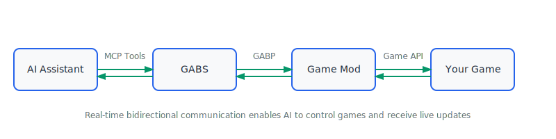

# GABS - Game Agent Bridge Server

**Let AI control your games naturally!**

GABS connects AI assistants to your games through a simple, secure bridge. Configure your games once, then ask your AI to start servers, check status, or manage multiple games—all through natural conversation.

## Why GABS?

**For Everyone:**
- **Simple Setup**: Configure games once with easy commands
- **Natural Control**: Ask AI to manage games in plain English
- **Works Everywhere**: Windows, macOS, Linux—one tool for all your games
- **Secure**: Everything runs locally by default
- **Real Examples**: "Start my Minecraft server", "Check if RimWorld is running", "Stop all games"

**For Modders:**
- **AI-Powered Development**: Let AI help test and debug your mods
- **Universal**: Works with any game that can add GABP support
- **Easy Integration**: Simple JSON protocol for mod developers

## How It Works

GABS uses a **configuration-first approach**. You set up your games once, then AI controls them through simple tools.



**Key Features:**
- **Configure once**: Add games with `gabs games add`
- **Control with AI**: Natural commands through MCP tools
- **Any game**: Works with modded games that support GABP
- **Any AI**: Works with Claude, ChatGPT, and custom AI tools
- **Live updates**: AI gets real-time notifications from your games

## Quick Start

### 1. Download GABS

Get the latest version for your system:
- **Windows**: [`gabs-windows-amd64.exe`](../../releases/latest)
- **macOS**: [`gabs-darwin-arm64`](../../releases/latest) 
- **Linux**: [`gabs-linux-amd64`](../../releases/latest)

### 2. Add Your Games

```bash
# Interactive setup (recommended)
gabs games add minecraft
gabs games add rimworld

# See what you've configured
gabs games list
```

GABS will ask simple questions to set up each game (where it's installed, how to launch it, etc.).

### 3. Start the Server

```bash
# For AI assistants
gabs server

# For web tools (optional)
gabs server --http localhost:8080
```

### 4. Connect Your AI

Add GABS to your AI's MCP settings:

**Claude Desktop:**
```json
{
  "mcpServers": {
    "gabs": {
      "command": "/path/to/gabs",
      "args": ["server"]
    }
  }
}
```

**Then ask your AI:**
- "List my games"
- "Start the Minecraft server"
- "Stop all running games"
- "Check the status of RimWorld"

## AI Tools Available

Once connected, your AI can use these tools:

### Core Game Management Tools
- **`games_list`** - Show all configured games and their status
- **`games_start`** - Start a game: `{"gameId": "minecraft"}`
- **`games_stop`** - Stop a game gracefully: `{"gameId": "minecraft"}`  
- **`games_kill`** - Force stop a game: `{"gameId": "minecraft"}`
- **`games_status`** - Check game status: `{"gameId": "minecraft"}`
- **`games_tools`** - List game-specific tools from connected mods

### Game-Specific Tools from Mods

**The real power comes from GABP-compliant mods that expose their own tools!**

When your games have GABP mods installed, they add game-specific tools like:
- **`minecraft_inventory_get`** - Get player inventory in Minecraft
- **`minecraft_world_place_block`** - Place blocks in Minecraft world  
- **`rimworld_inventory_get`** - Get colonist inventory in RimWorld
- **`rimworld_crafting_build`** - Build items in RimWorld

**Game ID Prefixing**: To avoid conflicts when multiple games are running, mod tools are automatically prefixed with the game ID (e.g., `minecraft_`, `rimworld_`). This lets AI clearly specify which game to control.

**Discovering Tools**: Use `games_tools` to see what tools each running game provides:
```
AI: "List available tools for Minecraft"
GABS: Shows minecraft_inventory_get, minecraft_world_place_block, etc.
```

**Pro tip**: You can use game names (`"minecraft"`) or launch IDs (`"294100"` for Steam) interchangeably.

## Documentation

- **[Configuration Guide](CONFIGURATION.md)** - Detailed setup for different game types
- **[AI Integration Guide](INTEGRATION.md)** - Connect GABS to different AI tools and deployment scenarios  
- **[Mod Development Guide](MOD_DEVELOPMENT.md)** - Add GABP support to your game mods
- **[Advanced Usage Guide](ADVANCED_USAGE.md)** - Multiple instances, HTTP mode, scripting, and more

## For Mod Developers

Want your game to work with GABS? Add GABP support to your mod:

1. **Read bridge config** when your game starts
2. **Start a GABP server** to listen for GABS connections  
3. **Expose game features** as tools, resources, and events

See the [Mod Development Guide](MOD_DEVELOPMENT.md) for complete examples in C#, Java, and Python.

## Build from Source

Requirements: Go 1.22+

```bash
go build ./cmd/gabs
```

## Contributing & Support

- **Issues & Ideas**: [GitHub Issues](../../issues)
- **GABP Protocol**: [GABP Repository](https://github.com/pardeike/GABP)
- **Examples**: Check the `examples/` directory

## License

MIT License - see [LICENSE](LICENSE) for details.

---

*GABS makes AI-game interaction simple. Configure once, control naturally.*
